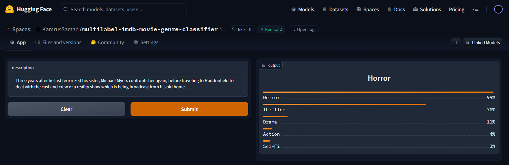
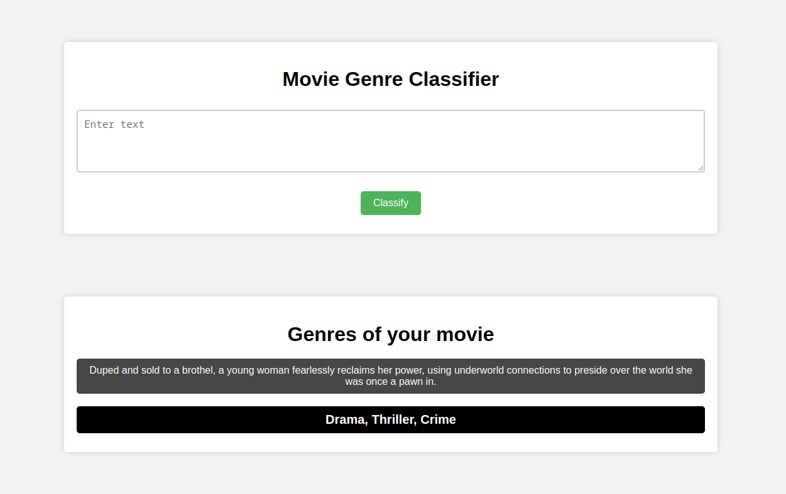

# Multilabel IMDb Movie Classification

This is a text classification project where I classify the genre of movies based on their IMDb descriptions.

I fine-tuned a pre-trained model, DistilRoberta-Base. After cleaning and encoding the data, I trained the model and achieved an accuracy of 88.5% and an F1 score (micro) of 56%. I saved the model and made it more usable by converting it to the ONNX format, which also made the model faster.

For deployment, I built a Flask web application that is hosted on a Render server, allowing users to easily classify the genre of a movie based on its description.

## Data

I scraped movie data from [IMDb](https://www.imdb.com/search/title/num_votes=10000%2C&sort=user_rating%2Cdesc&title_type=feature&fbclid=IwAR0ZueVl7ORllVRRfhI_zMUyLXc9tdCazy6zaGcIdGK28XSrAZ1YYRP2Ax4) using Selenium, collecting almost 9300 descriptions across 21 genres. The data was cleaned and encoded before training the text classification model.  

**Dataset: [Here](https://github.com/KsLimon/Multilabel-imdb-movie-genre-classifier/blob/master/data/Movies_categorical_data.csv)**

## Model

I fine-tuned a pre-trained DistilRoberta-Base model using HuggingFace Transformers using Fastai and Blurr. The model has 12 attention heads and 6 hidden layers. After training, I achieved an accuracy of 88.5% and an F1 score (micro) of 56%. I converted the model to the ONNX format, making it faster and more usable. The model training notebook can be found [here](https://github.com/KsLimon/Multilabel-imdb-movie-genre-classifier/tree/master/notebooks).

## Model Deployment

The compressed model is deployed to HuggingFace Spaces Gradio App. The implementation can be found in `deployment` folder. You can visite [here](https://huggingface.co/spaces/KamrusSamad/multilabel-imdb-movie-genre-classifier) to see the demo.

  

## Web Deployment
I also developed a Flask web App using [space api](https://kamrussamad-multilabel-imdb-movie-genre-clas-253b5da.hf.space/run/predict) to take descprition and show the genres as output. Check `gh-pages ` branch to find the code. The website is live [here](https://multilabel-imdb-movie-genre-classifier.onrender.com/) 

## Limitations

The current model is good enough but has limitations in classifying movie genres based on descriptions cause most of the description are too short. Further improvements could be made in data collection and preprocessing, model architecture, and feature engineering.

## Contributions

Contributions to this project are welcome. You can fork the repository and submit a pull request, or submit an issue with suggestions for improvements.

## Future Work

In future work, I aim to improve the model's accuracy in genre classification by exploring more complex architectures and feature engineering techniques. I also plan to collect more diverse and higher-quality data to further train and evaluate the model.

## Conclusion

This project demonstrates the process of collecting, cleaning, and encoding data, training and fine-tuning a pre-trained model, and deploying the model as a web application. While the current model has limitations, I hope this project provides insights into the text classification process and inspires further improvements in this field.

